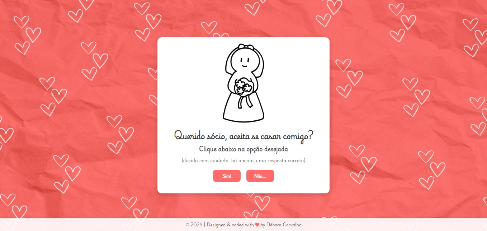

  

<h1>💍Pedido Especial</h1>

 
  Para os apaixonados, esta é uma forma divertida de pedido de casamento. O usuário é desafiado a tomar uma decisão especial: ao clicar na opção 'Sim', confetes aparecem na tela enquanto uma mensagem de felicitações se revela. Uma função que faz o botão 'Não' 'fugir' antes que o usuário possa clicá-lo adiciona um toque divertido e inesperado. Esta aplicação foi feita utilizando HTML, CSS e Javascript.

 

<h2>💻Tecnologias e ferramentas utilizadas</h2>

   
   
     
          

 

<h2>❤️Acesse o site através do link abaixo:</h2>
<a href="https://debora-carvalho.github.io/pedidoCasal/" target="_blank">Site para um pedido especial</a>

📆 Atualizado em julho, 2024.
 

